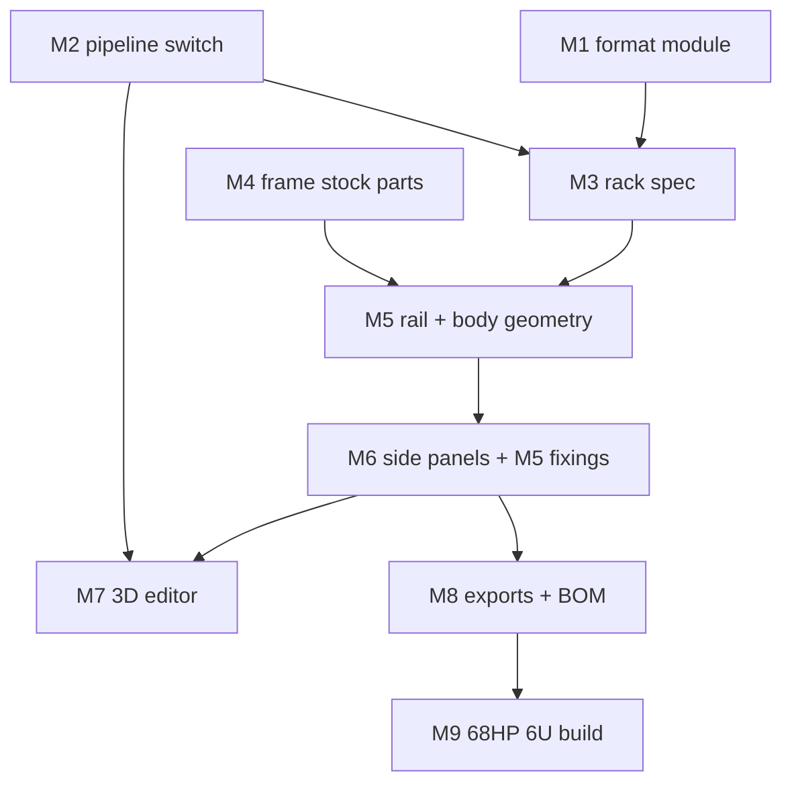

# Development Plan — Eurorack U-Profile Case Designer

## 1. Context & Source Map

The repo has one case pipeline: resolve a scene of measured boards and slice a
bounding solid into sheet layers (`hwcase.case.build`). That is *part-driven* —
the hardware decides the box.

A Eurorack frame is the opposite. The **format decides the box** before any
module exists, and the case is not a slab stack: it is a set of **extrusions and
folded sheet**. So this is a second pipeline, chosen at project start, sharing
the part library, confidence ladder, `check` and export surfaces.

Everything in this case is an extrusion or a flat plate, which makes the whole
generator a matter of producing a cross-section and a length.

| Plan section | Source |
| --- | --- |
| §3 the assembly model | Builder's description, confirmed 2026-09-06: the rail *is* the case edge; the aluminium body sits under the rail's lip |
| §6 M1 | `docs/eurorack.md` §§1–3, 6, 9 (Doepfer, verified 2026-09-05) |
| §6 M1 defect fix | `docs/research.md:37`, `docs/measurements.md:61,144`, `backend/parts/misc.yaml:183,197` |
| §6 M2 | "user can choose in the beginning whether we build a adafruit database based case or a Eurorack u-profile case" |
| §6 M4–M5 | `docs/eurorack-frame-stock.md` — rail Art. 16500; U-channel al5905100upko 376 × 40/216/40 × 1.0 mm |
| §6 M5 width rule | f&w published rail lengths: 84 TE = 427 mm = `84 × 5.08` rounded up |
| §6 M6 side panels | The 5U acrylic panel, 237 × 52 × 5, decoded in §3.4 |
| §6 M7 | `web/app.js`, `web/store.js` — the browser extrudes what `/api/build` returns |
| §6 M9 | "68hp 6u next, and two 4hp inserts on both side panels" |

## 2. Assumptions & Gaps

> **RESOLVED — assembly.** All earlier ambiguity about which dimension is width,
> height or depth is settled and written up in §3. Superseded readings have been
> deleted from this plan rather than annotated, so nothing stale remains.

> **CORRECTED — the 76 HP error.** An earlier revision of this plan had the
> frame at 76 HP / 386.08 mm. That was wrong and originated here, not with the
> builder. **68 HP is the rail span.** The side panels add 4 HP each *on top of*
> it. See §3.5.

> **CORRECTED — the panel-width table.** An earlier revision claimed applying
> Doepfer's panel-width table to the frame produces "an error that grows with
> HP". It does not: the deduction is a flat 0.3 mm regardless of HP. The frame
> uses nominal `HP × 5.08` because that is what suppliers cut to, and because
> with sliding nuts there is no fixed hole pattern for a fractional millimetre
> to fall out of register with.

> **ASSUMPTION A-1.** The rack pipeline produces **members** — a cross-section
> polygon, a length and a pose — not a `CaseModel` of sheet layers. Rails, the
> folded body and the side plates are all extrusions, so one representation
> covers the case. Slicing an aluminium extrusion into 3 mm layers would be a
> category error.

> **ASSUMPTION A-2.** `Scene.kind` defaults to `"parts"`, so every existing
> scene keeps working untouched.

> **ASSUMPTION A-3.** `c = 2.30 mm` (§3.3) is fitted from **one** case. It is
> the only fitted constant in the model; everything else is rack arithmetic.
> Marked `estimated` until a caliper crosses the built case.

> **CORRECTED — there is no "four rails, two flange edges" problem.** An earlier
> revision raised it as a blocker. It was based on a wrong assumption that the
> rails hang off the U-channel's flange edges. They do not: **the side panels
> carry every rail**, one M5 per rail end, which is why the built 5U panel has
> six holes for its six rails. A case has **one body** whatever its height; only
> the web grows. See §3.6.

> **GAP-1 (documentation only).** The built 5U panel uses 35 mm for its 1U row
> spans and 10 mm row gaps, where the rack model gives 33.60 and 10.85 — 1.6 mm
> of accumulated difference over 5U. Whether the generator reproduces the built
> numbers or the rack-correct ones is a choice; sliding nuts absorb either.

> **GAP-2 (release policy).** No tags, no `CHANGELOG.md`, no CI. Every milestone
> targets `unversioned`; no milestone creates version, changelog or tag work.

## 3. The assembly model

This section is the thing the rest of the plan is built on. It is settled.

### 3.1 The rail is the case edge

The rail (f&w Art. 16500, "mit Kante") is not a part bolted inside a case — it
*is* the case's visible front edge. Installed:

| | mm | axis |
|---|---:|---|
| height | **10.00** | Y |
| depth | **19.00** | Z, into the case |
| module slot centre | **5.00** from each edge | centred in the 10.00 |
| sheet slot | 1.50 | takes the 1.0 mm body flange |
| end-fixing channel | Ø **4.40** | takes an **M5** into the rail's end |

The drawing's 19.00 "height" is the installed *depth*. The proof is stacking:
adjacent rows' slot centres are 10.85 mm apart, and a 10.00 mm tall rail drops
into that gap with 0.85 mm to spare. At 19 mm tall it could not.

### 3.2 The body hangs under the rail

The aluminium U-channel (1.0 mm, folded 40 / web / 40) sits **under** the rail's
lip. Its flange edge slides into the rail's 1.50 mm slot and a sliding nut in
the channel below bolts the two together. So the body is *smaller* than the
case's outer envelope — the rail overhangs it by `5.00 − 2.30 = 2.70 mm` per
edge.

The 40 mm flange is the case depth. It is fixed by the stock, not derived.

### 3.3 Height is rack arithmetic plus one constant

Slot centres sit `SLOT_DEDUCT / 2 = 5.425 mm` inside each rack boundary, so the
outermost slot span over `U` total units is `U × 44.45 − 10.85`. The body's web
edge sits `c = 2.30 mm` outboard of the outermost slot centre:

```
web(U) = (U × 44.45 − 10.85) + 2c
       = U × 44.45 − 6.25            with c = 2.30
```

| | slot span | web |
|---|---:|---:|
| 3U | 122.50 | 127.10 |
| 5U | 211.40 | **216.00** ← the built case, exactly |
| 6U | 255.85 | 260.45 |
| 9U | 389.20 | 393.80 |

`c` is fitted from the 5U sample (A-3). Everything else is derived.

### 3.4 The side panel, decoded

The 237 × 52 × 5 mm tinted acrylic is the **5U side panel**, and its holes are
not arbitrary — they are the M5 rail fixings for three rows:

| holes (mm) | span | row |
|---|---:|---|
| 12 / 47 | 35 | 1U |
| 57 / 180 | **123** | **3U** (rack model: 122.50) |
| 190 / 225 | 35 | 1U |

Row gaps 10 mm, margins 12 mm each end, outer span 213 mm. **So "5U" here means
1U + 3U + 1U.** The 237 mm dimension is height; 52 mm is depth; the Ø5.0 holes
are M5 clearance and sit 37 mm along the depth axis.

The 112 × 21 mm cutout that breaks one edge is the **4 HP insert slot**: 21 mm
is 4 HP (20.32), 112 mm clears a 3U module's PCB (panel height less ~16.5), it
is centred on the 3U row, and it breaks the edge so a module slides in
sideways.

### 3.5 The side panels carry the rails; there is one body

Structurally the case is: **two side panels, every rail bolted between them with
one M5 per end, and one body.** The body is not a chassis — it slides into the
rails' 1.50 mm slots and is bolted with sliding nuts, skinning the case and
stiffening it. A case has exactly one body however tall it is; only its web
grows.

That is what the built panel proves: six M5 holes for six rails, three rows of
two. The relation closes on both known sizes:

```
rails            = 2 per row
M5 holes/panel   = rails
panel height     = web + 2 x rail_height     216 + 20 = 236 (cut 237)
```

| | 5U built | 6U derived |
|---|---|---|
| rows | 1U + 3U + 1U | 3U + 3U |
| M5 holes | 12, 47, 57, 180, 190, 225 | 12, 135, 145, 268 |
| panel height | 237 | 280 |
| web | 216 | 260 (model 260.45) |

### 3.6 Capacity

The rail span is the case's nominal HP. Each side panel contributes a further
4 HP through its slot, **outboard of the rails**:

```
frame width   = HP × 5.08                    68 HP → 345.44 mm (cut 345)
module capacity = HP + 8 per 3U row          68 HP → 76 HP usable
```

## 4. Release Trains

| Target release | Included milestones | Preparation trigger | Required artifacts | Verification | Publication |
| --- | --- | --- | --- | --- | --- |
| `unversioned` | `M1..M9` | All included milestones externally merged. | `none` — GAP-2 | `cd backend && python -m pytest tests/ -q` exits 0 | `not requested` |

## 5. Plan Evolution Protocol

- The committed plan and prompt files are authoritative; the ignored history
  ledger is reconstructible local evidence.
- Before each milestone, inspect its plan/prompt rows, the source map, current
  code, merged predecessor diffs and verification evidence.
- Record exactly one `DESIGN GO — PLAN REVISION: none`,
  `DESIGN GO — PLAN REVISION: <entry IDs>`, or `DESIGN NO-GO — REASON: <...>`.
- A material mismatch updates the current milestone and every affected future
  milestone in both authoritative files, then recomputes the DAG and trains.
- Superseded understanding is **deleted**, not annotated. §2 keeps only the two
  corrections that a reader needs in order not to repeat them.
- `DESIGN NO-GO` blocks code. A material revision needs a docs-only
  reconciliation PR, merged before implementation.

## 6. Sections & Milestones

### Section A — Grounding

#### M1 — Eurorack format module, and the 122.5 mm correction

| Field | Value |
| --- | --- |
| Objective | The format's arithmetic lives in one module, and the rail-spacing defect is corrected everywhere it was copied. |
| In / Out of scope | In: HP and U grids, `panel_width` vs `frame_width`, `slot_span`, row formats, the four 123.5 mm sites. Out: any geometry. |
| Depends on | `none` |
| Target release | `unversioned` |
| Deliverables | `backend/hwcase/eurorack.py`; corrections at `misc.yaml:183,197` (rail holes → y 3.0 / 125.5), `research.md:37`, `measurements.md:61,144`. |
| Acceptance | (1) All 16 published HP panel widths asserted exactly. (2) `panel_width` never exceeds a tabled value. (3) `frame_width(84)` rounds to f&w's 427 mm. (4) `slot_span(3)` == 122.5. (5) 3U rail hole Ys are 3.0 / 125.5. (6) No rail-spacing `123.5` remains. |
| Verification | `cd backend && python -m pytest tests/ -q`; `grep -rn "123\.5" docs backend \| grep -i rail` → empty. |
| Design reevaluation | Confirm `docs/eurorack.md` §§2–3 unchanged. Dependents: **M3, M5, M6, M9**. |
| Risks & rollback | Changing the AMYboard panel's hole Ys alters a shipped part's geometry; note it in `src.note`. Rollback: the stack. |
| Est. PRs | 2 |

#### M2 — Pipeline discriminator

| Field | Value |
| --- | --- |
| Objective | A scene declares which pipeline builds it; every existing scene behaves exactly as before. |
| In / Out of scope | In: `Scene.kind`, scaffolding, API pipeline listing, build dispatch. Out: rack geometry. |
| Depends on | `none` |
| Target release | `unversioned` |
| Deliverables | `Scene.kind: Literal["parts","rack"] = "parts"`; `hwcase.cli new --kind`; dispatch in `cli.build`. |
| Acceptance | (1) All five existing scenes build byte-identically. (2) `new --kind rack` produces a scene `check` accepts. (3) Unknown kind fails with a named error. (4) `scenefile` does not write `kind` into scenes that lacked it. |
| Verification | `cd backend && python -m pytest tests/ -q`; build each scene before/after → identical file set and sizes. |
| Design reevaluation | Confirm ruamel round-trip preserves comments. Dependents: **M3, M7**. |
| Risks & rollback | A new key could strip comments on save; asserted in a test. Rollback: the stack. |
| Est. PRs | 2 |

### Section B — The frame

#### M3 — Rack specification schema and checks

| Field | Value |
| --- | --- |
| Objective | A frame of any size is described by validated data, and impossible frames are rejected before anything is cut. |
| In / Out of scope | In: `RackSpec`, `RackRow` (a `RowFormat` + HP), side-panel insert spec, checker rules. Out: geometry. |
| Depends on | `M1, M2` |
| Target release | `unversioned` |
| Deliverables | Models mirroring `CaseSpec`'s style; rules for HP capacity, insert fit, row stacking, rail collision (rows closer than 10.85 mm of slot gap given a 10.00 mm rail). |
| Acceptance | (1) A row stack whose rails would collide errors. (2) An insert wider than the side panel's depth errors. (3) A mixed `1U + 3U + 1U` stack validates and reports 5U. (4) A 68 HP 6U spec reports 0 errors. |
| Verification | `cd backend && python -m pytest tests/ -q`; `python -m hwcase.cli check <rack fixture> --strict` → exit 0. |
| Design reevaluation | Rows must be an ordered list of formats, not a count, or 1U mixing is inexpressible. Dependents: **M5, M6, M8, M9**. |
| Risks & rollback | Modelling rows as `count × 3U` would make §3.4's built case unrepresentable. Rollback: the stack. |
| Est. PRs | 3 |

#### M4 — Frame stock as measured parts

| Field | Value |
| --- | --- |
| Objective | The real stock is in the library with honest confidence tags. |
| In / Out of scope | In: `backend/parts/eurorack-frame.yaml` — rail, U-channel, acrylic, sliding nuts, M5 and M3 screws. Out: geometry, length rules. |
| Depends on | `none` |
| Target release | `unversioned` |
| Deliverables | Entries traceable to a row of `docs/eurorack-frame-stock.md`, each citing its supplier article number. |
| Acceptance | (1) `parts` lists them. (2) Every dimension is `measured`/`datasheet`, or listed as outstanding in `docs/measurements.md`. (3) No `estimated` in this file. (4) The rail records its **installed** orientation per §3.1, not the drawing's. |
| Verification | `cd backend && python -m hwcase.cli parts`; `python -m hwcase.cli audit --strict` → exit 0. |
| Design reevaluation | Resolve the acrylic's asymmetric Ø3 holes (x = 59 vs 180) against the physical part. Dependents: **M5, M6**. |
| Risks & rollback | Recording the drawing's orientation instead of the installed one inverts every case. Rollback: the stack. |
| Est. PRs | 1 |

#### M5 — Rail and body geometry

| Field | Value |
| --- | --- |
| Objective | A validated spec becomes parametric 3D: rails extruded to length, and a folded body whose web follows the row stack. |
| In / Out of scope | In: `backend/hwcase/rack.py` — `Member` (section polygon + length + pose), rail profile, U-body, row/rail layout, per-row slot positions. Out: side panels (M6), exports (M8), UI (M7). |
| Depends on | `M3, M4` |
| Target release | `unversioned` |
| Deliverables | `rack.build(spec) -> RackModel`; rail length `= HP × 5.08`; web `= U × 44.45 − 6.25`; flange 40; rail Y positions from each row's slot span; deterministic. |
| Acceptance | (1) A `1U+3U+1U` stack reproduces the built 5U web of **216.00 mm**. (2) Rail count == 2 × rows. (3) Every rail Y equals a row slot centre from `eurorack.slot_span`. (4) `frame_width(68)` == 345.44. (5) Two builds are identical. |
| Verification | `cd backend && python -m pytest tests/ -q`; `python -m hwcase.cli build <rack fixture> -o ../out`. |
| Design reevaluation | Confirm §3.5 still holds: the side panels carry every rail and a case has one body. Dependents: **M6, M7, M8, M9**. |
| Risks & rollback | Aluminium is bought to length and drilled once; an off-by-one in a rail Y costs an extrusion. Rollback: the stack. |
| Est. PRs | 4 |

#### M6 — Parametric side panels with M5 fixings and 4 HP slots

| Field | Value |
| --- | --- |
| Objective | The side panel generates itself from the row stack — M5 holes where the rails land, 4 HP slots where inserts go. |
| In / Out of scope | In: side-panel outline, procedurally derived M5 hole pattern, insert slots, margins. Out: exports, UI. |
| Depends on | `M5` |
| Target release | `unversioned` |
| Deliverables | Panel outline `height = web + 2 × margin`, depth from the flange plus overhang; one M5 hole per rail end; one slot per insert, `insert_hp × 5.08` across and PCB-clearance long, centred on its row and breaking the inner edge. |
| Acceptance | (1) For `1U+3U+1U` the generated M5 pattern reproduces the built panel's three spans **35 / 123 / 35** with 10 mm gaps (or the rack-correct 33.6/122.5/10.85 — GAP-1's choice, asserted either way). (2) Panel outline is 237 × 52 for that stack. (3) Hole count == rail count. (4) Each insert slot is 4 HP across and breaks exactly one edge. |
| Verification | `cd backend && python -m pytest tests/ -q`. |
| Design reevaluation | Settle GAP-1 before asserting hole spans. Dependents: **M7, M8, M9**. |
| Risks & rollback | A slot that fails to break the edge cannot be assembled — the module cannot slide in. Rollback: the stack. |
| Est. PRs | 3 |

### Section C — Seeing it and shipping it

#### M7 — 3D in the editor

| Field | Value |
| --- | --- |
| Objective | The frame is visible and parametric in the editor: change U, HP or the row mix and the model follows. |
| In / Out of scope | In: pipeline chooser, rack controls (rows, HP, inserts), member extrusion in the existing three.js preview. Out: mixed parts+rack scenes. |
| Depends on | `M2, M6` |
| Target release | `unversioned` |
| Deliverables | `/api/build` returns members for rack scenes; the browser extrudes a section along a length as it already extrudes a layer along Z. |
| Acceptance | (1) Choosing "Eurorack frame" creates a scene `check` accepts. (2) Changing rows from `3U` to `1U+3U+1U` changes the rendered web height. (3) Parts scenes render unchanged. (4) Store tests cover the branch. |
| Verification | `cd web && node --test tests/`; `cd backend && python -m pytest tests/ -q`. |
| Design reevaluation | Read `web/store.js` and its tests (currently uncommitted) first. Dependents: **none**. |
| Risks & rollback | Extruding a section along X when the viewer assumes Z would silently transpose the case. Rollback: the stack. |
| Est. PRs | 3 |

#### M8 — Exports and bill of materials

| Field | Value |
| --- | --- |
| Objective | The frame leaves the tool as something a person can cut, drill and buy from. |
| In / Out of scope | In: per-member cutlist and drill DXFs, side-panel DXF, BOM. Out: UI. |
| Depends on | `M6` |
| Target release | `unversioned` |
| Deliverables | Cutlist naming each member, its length and hole offsets from a **named datum end**; BOM in supplier terms (profile mm, rail mm, M5/M3 counts, sliding nuts). |
| Acceptance | (1) A rack build writes a cutlist and at least one DXF. (2) Every hole offset matches the model within 0.01 mm. (3) M5 count == rail ends == 2 × rails. (4) Exports match existing gitignore patterns. |
| Verification | `cd backend && python -m pytest tests/ -q`; build the reference scene and inspect the cutlist. |
| Design reevaluation | Confirm `export.write_all` fits a non-layer model. Dependents: **M9**. |
| Risks & rollback | An ambiguous datum end mis-drills every member identically. Rollback: the stack. |
| Est. PRs | 3 |

### Section D — The target

#### M9 — 68 HP 6U reference frame

| Field | Value |
| --- | --- |
| Objective | The frame being built next comes out of the tool, checked and ready to cut. |
| In / Out of scope | In: the scene, its exports, a README section. Out: new engine capability. |
| Depends on | `M8` |
| Target release | `unversioned` |
| Deliverables | `backend/scenes/rack-68hp-6u.yaml`: two 3U rows, 68 HP rail span, one 4 HP side slot per side per row. |
| Acceptance | (1) `check --strict` → exit 0. (2) Frame width resolves to **345.44 mm**. (3) Web resolves to **260.45 mm** and the side panels to **280 mm** tall with M5 holes at 12 / 135 / 145 / 268. (4) Four 4 HP slots — one per side per row — giving **76 HP** capacity. (5) BOM lists 4 rails, 8 M5 screws, the body and two side panels. |
| Verification | `cd backend && python -m hwcase.cli check scenes/rack-68hp-6u.yaml --strict`; `build … -o ../out`. |
| Design reevaluation | GAP-1 must be closed. Dependents: **none**. |
| Risks & rollback | A side panel drilled to the wrong row stack scraps two acrylic plates. Rollback: the stack. |
| Est. PRs | 2 |

## 7. Cross-Cutting Concerns

- **Measurement honesty.** `c = 2.30` is the single fitted constant and is
  marked `estimated` (A-3). Every other number is rack arithmetic or supplier
  data.
- **Irreversibility.** Extrusion is bought to length and drilled once; every
  acceptance row touching a hole position asserts exact coincidence.
- **Determinism.** `rack.build` re-runs on every editor change, like
  `case.build`.
- **Back-compatibility.** M2's acceptance is byte-identical exports.
- Release management: none — GAP-2.

## 8. Dependency Graph and Critical Path



Critical path: **M1 → M3 → M5 → M6 → M8 → M9.** M2 and M4 run in parallel; M7
is a leaf. No milestone is blocked on an unanswered question: the assembly model
in §3 is closed, and GAP-1 is a choice between two working conventions rather
than a missing fact.
